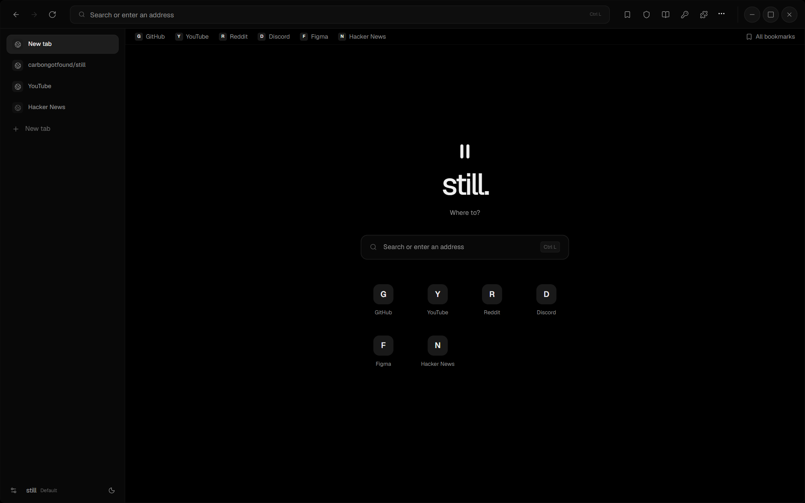
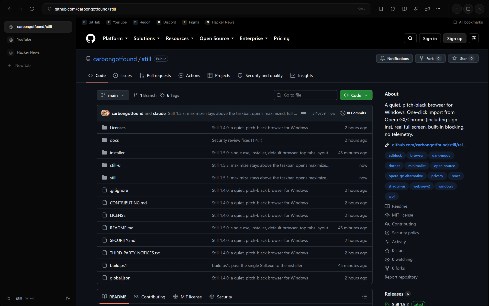

<div align="center">

# still.

**A quiet, pitch-black browser for Windows.**
No clutter, no account, no telemetry. Just the web, and room to breathe.

[**⬇ Download for Windows**](https://github.com/carbongotfound/still/releases/latest) · [Features](#features) · [Build from source](#build-from-source)



</div>

---



## Why Still?

Most browsers keep getting louder: sidebars full of apps, news feeds, sponsored tiles and pop-ups. Still goes the other way. It's a true-black, keyboard-first browser that shows the page and nothing else, and it moves over from your old browser in one click.

## Features

- **True black by default.** An OLED-friendly interface with Light and System themes. Motion is smooth but restrained, and reduced-motion settings are respected.
- **One-click import from Opera GX, Chrome, Edge, Brave and Vivaldi.** Bookmarks, history, saved passwords and **signed-in sessions** (cookies) come across, so you stay logged in.
- **A real Windows app and default browser.** One `Still.exe`, a Start Menu entry, and it can be set as the default browser so links open in the Still window you already have open.
- **Real full screen.** Hides the Windows taskbar for videos and games, with your tabs still visible if you want them.
- **Built-in blocking.** Tracker and ad-domain blocking, native tracking prevention and a one-click [uBlock Origin Lite](https://github.com/uBlockOrigin/uBOL-home) installer that checks the download's hash.
- **Password vault.** Passwords are encrypted with Windows DPAPI and filled in only on the exact site they belong to. Nothing is synced anywhere.
- **Bookmarks bar and Speed Dial.** Right-click a bookmark to edit, move, copy or delete it.
- **Profiles and private tabs.** Separate profiles for work and personal use, and isolated InPrivate tabs.
- **Vertical or top tabs.** You can resize, pin, sleep and mute tabs, and memory saver releases tabs you aren't using.
- **Keyboard first.** <kbd>Ctrl L</kbd> address bar, <kbd>Ctrl K</kbd> find any tab, <kbd>Ctrl Shift T</kbd> reopen a closed tab, <kbd>F11</kbd> full screen.
- **Extras.** Reader mode, "hide an element" on any page, picture-in-picture and find in page.

## Still vs. the usual suspects

| | Still | Opera GX | Chrome |
|---|:-:|:-:|:-:|
| Account or sign-in required | No | Optional | Optional |
| Telemetry | **None** | Yes | Yes |
| Built-in ad/tracker blocking | ✅ | ✅ | ❌ |
| Imports sign-ins from other browsers | ✅ | Partial | Partial |
| Sponsored tiles and feeds | **None** | Yes | Some |
| Open source | ✅ MIT | ❌ | Partly (Chromium) |

## Install

1. Download **`Still-Setup-x64.exe`** from the [latest release](https://github.com/carbongotfound/still/releases/latest) and run it. No admin rights are needed.
2. Still installs as a normal Windows app, with a Start Menu entry and an entry in Settings → Apps. Installing a newer setup updates the same `Still.exe` in place, and your data is kept.
3. To make Still your default browser, choose **Settings → Make default** in Still (or tick the option at the end of setup), then pick Still in Windows Default apps. Links from other apps will then open in Still.

Prefer portable? Download the single **`Still.exe`** and run it.

Requires Windows 10/11 x64 and the [Microsoft Edge WebView2 Runtime](https://developer.microsoft.com/microsoft-edge/webview2/). Windows 11 already has it, and setup installs it if it's missing. The .NET runtime is built into `Still.exe`.

> Still isn't code-signed yet, so Windows SmartScreen may warn you on first launch. Choose **More info → Run anyway**, or build it yourself from source.

## Shortcuts

| Action | Shortcut |
|---|---|
| Address / search | <kbd>Ctrl L</kbd> |
| Find an open tab | <kbd>Ctrl K</kbd> |
| New / close tab | <kbd>Ctrl T</kbd> / <kbd>Ctrl W</kbd> |
| Reopen closed tab | <kbd>Ctrl Shift T</kbd> |
| Private tab | <kbd>Ctrl Shift N</kbd> |
| Bookmark page | <kbd>Ctrl D</kbd> |
| Reader mode | <kbd>Ctrl Shift R</kbd> |
| Full screen | <kbd>F11</kbd> |
| Settings | <kbd>Ctrl ,</kbd> |

## How it's built

- **Engine:** Microsoft Edge WebView2 (Chromium), hosted in a native **WPF / .NET 10** window.
- **Interface:** React, [shadcn/ui](https://ui.shadcn.com), Radix, Motion and the Geist font, all packaged locally. No web server and no CDN calls.
- **Privacy:** no Still account, no analytics and no update pings. Your data stays in `%LOCALAPPDATA%\Still`.

## Build from source

Requires the .NET 10 SDK and Node 22.12+.

```powershell
git clone https://github.com/carbongotfound/still
cd still
./build.ps1          # builds the UI, then publishes a single Still.exe to artifacts/Still
```

## Security

See [SECURITY.md](SECURITY.md) and the [security review](docs/SECURITY-REVIEW.md). Still has had an internal code review but no independent third-party audit yet, so please report vulnerabilities privately.

## Credits

The design is inspired by [Search by Office Commun](https://officecommun.com/search). Third-party components keep their own licenses; see [THIRD-PARTY-NOTICES.txt](THIRD-PARTY-NOTICES.txt).

MIT © 2026 Carbon
