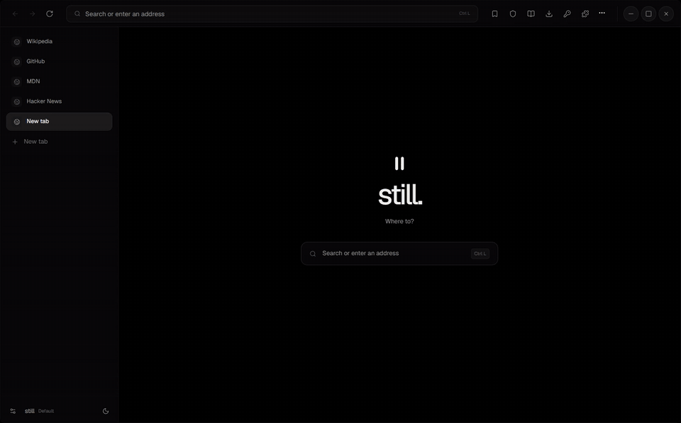

<div align="center">

# still.

**The browser that blocks ads everywhere, YouTube included.** Free and open source for Windows and Mac, with no account, no telemetry and nothing on screen but the page.

It blocks ads everywhere, YouTube included, and on Windows it moves over from Opera GX, Chrome, Edge, Brave or Vivaldi in one click, signed-in sessions included.

[**⬇ Download for Windows**](https://github.com/carbongotfound/still/releases/latest/download/Still-Setup-x64.exe) · [**⬇ Download for Mac**](https://github.com/carbongotfound/still/releases/latest/download/Still-mac.zip) · [**Features**](#features) · [**Install**](#install) · [**AI agents**](#ai-agents) · [**Build from source**](#build-from-source)

[](https://github.com/carbongotfound/still/releases/latest)
[](https://github.com/carbongotfound/still/releases)
[](./LICENSE)


</div>

<p align="center"></p>

<div align="center">

True black, keyboard first, and nothing on screen but the page. Vertical or top tabs,
<kbd>Ctrl K</kbd> to jump to any tab, built-in blocking that takes out YouTube ads too,
and real full screen. A native app on Windows and Mac, no Still account, no telemetry.

</div>

> **Free and open source.** MIT licensed, built on Microsoft Edge WebView2 and .NET 10 on Windows and on WebKit and Swift on Mac. Your bookmarks, history, passwords and sessions stay on your computer, in `%LOCALAPPDATA%\Still`.

> **Not code-signed yet.** On Windows, SmartScreen may warn on first launch: choose **More info → Run anyway**. On Mac, right-click Still and choose **Open** the first time. Or [build it yourself](#build-from-source).

## Why Still?

Most browsers keep getting louder: sidebars full of apps, news feeds, sponsored tiles and pop-ups. Still goes the other way. It's a true-black, keyboard-first browser that shows the page and nothing else, and it moves over from your old browser in one click.

## Features

- **True black by default.** An OLED-friendly interface with Light and System themes. Motion is smooth but restrained, and reduced-motion settings are respected.
- **One-click import from Opera GX, Chrome, Edge, Brave and Vivaldi** (Windows). Bookmarks, history, saved passwords and **signed-in sessions** (cookies) come across, so you stay logged in.
- **A real desktop app and default browser.** One `Still.exe` with a Start Menu entry on Windows, a native Still.app on Mac, and either can be your default browser so links open in the Still window you already have open.
- **AI agents (MCP, Windows).** Turn on *Settings → Let AI agents control Still*, then add `Still.exe --mcp` to Claude Desktop, Cursor or any MCP app. Agents can open, read, click, type and screenshot pages. You approve each app first, a bar shows what it is doing with a Stop button, and private tabs, passwords and cookies are never exposed.
- **Real full screen.** Hides the Windows taskbar for videos and games, with your tabs still visible if you want them.
- **Built-in blocking.** Tracker and ad-domain blocking and native tracking prevention. On YouTube, ads are stripped before the page sees them, so video, home-feed, search, banner and sidebar ads never load, and any ad that still slips through is muted and skipped automatically.
- **Chrome Web Store extensions (Windows).** Open an extension in the Chrome Web Store and press **Add to Still**. You review its permissions before it installs. Signed store packages retain their publisher identity, and extension popup and settings pages can be opened from Extensions. Compatibility depends on WebView2 and the extension's desktop companion, where required.
- **Password vault (Windows).** Passwords are encrypted with Windows DPAPI and filled in only on the exact site they belong to. Nothing is synced anywhere.
- **Bookmarks bar and Speed Dial.** Right-click a bookmark to edit, move, copy or delete it.
- **Profiles and private tabs.** Separate profiles for work and personal use, and isolated InPrivate tabs.
- **Vertical or top tabs.** You can resize, pin, sleep and mute tabs. Memory saver sleeps idle background tabs after a minute while retaining page state; media, calls and downloads stay awake.
- **Downloads.** Double-click a completed download to open its file with your Windows default app.
- **Keyboard first.** <kbd>Ctrl L</kbd> address bar, <kbd>Ctrl K</kbd> find any tab, <kbd>Ctrl Shift T</kbd> reopen a closed tab, <kbd>F11</kbd> full screen.
- **Extras.** Reader mode, "hide an element" on any page, picture-in-picture and find in page.

## Still vs. the usual suspects

| | Still | Opera GX | Chrome |
|---|:-:|:-:|:-:|
| Account or sign-in required | No | Optional | Optional |
| Telemetry | **None** | Yes | Yes |
| Built-in ad/tracker blocking | ✅ | ✅ | ❌ |
| Imports sign-ins from other browsers | ✅ | Partial | Partial |
| Sponsored tiles and feeds | **None** | Yes | Some |
| Open source | ✅ MIT | ❌ | Partly (Chromium) |

## Install

### Windows

1. Download **`Still-Setup-x64.exe`** from the [latest release](https://github.com/carbongotfound/still/releases/latest) and run it. No admin rights are needed.
2. Still installs as a normal Windows app, with a Start Menu entry and an entry in Settings → Apps. Installing a newer setup updates the same `Still.exe` in place, and your data is kept.
3. To make Still your default browser, choose **Settings → Make default** in Still (or tick the option at the end of setup), then pick Still in Windows Default apps. Links from other apps will then open in Still.

Prefer portable? Download the single **`Still.exe`** and run it.

Requires Windows 10/11 x64 and the [Microsoft Edge WebView2 Runtime](https://developer.microsoft.com/microsoft-edge/webview2/). Windows 11 already has it, and setup installs it if it's missing. The .NET runtime is built into `Still.exe`.

### Mac

1. Download **`Still-mac.zip`** from the [latest release](https://github.com/carbongotfound/still/releases/latest), unzip it and drag **Still** into Applications. It runs natively on Apple silicon and Intel Macs with macOS 12.3 or later.
2. Still isn't notarized yet, so the first time, right-click Still and choose **Open** (on macOS 15, open it once, then choose **Open Anyway** in System Settings → Privacy & Security).
3. To make Still your default browser, choose **Settings → Make default** in Still.

Still for Mac runs the same interface on Apple's WebKit, with tabs, private tabs, history, bookmarks, downloads, themes, both tab layouts, full screen and the same blocking. Importing from other browsers, the password vault, extensions, profiles, AI agents and in-app updates are Windows-only for now. Shortcuts use <kbd>⌘</kbd> in place of <kbd>Ctrl</kbd>.

## Shortcuts

| Action | Shortcut |
|---|---|
| Address / search | <kbd>Ctrl L</kbd> |
| Find an open tab | <kbd>Ctrl K</kbd> |
| New / close tab | <kbd>Ctrl T</kbd> / <kbd>Ctrl W</kbd> |
| Reopen closed tab | <kbd>Ctrl Shift T</kbd> |
| Private tab | <kbd>Ctrl Shift N</kbd> |
| Bookmark page | <kbd>Ctrl D</kbd> |
| Reader mode | <kbd>Ctrl Shift R</kbd> |
| Full screen | <kbd>F11</kbd> |
| Settings | <kbd>Ctrl ,</kbd> |

## AI agents

Turn on *Settings → Let AI agents control Still*. MCP apps (Claude Desktop, Cursor…) run `Still.exe --mcp`; terminal agents (Claude Code, Codex…) run one command per step:

```powershell
Still.exe --cli read_page                       # title, url, numbered elements, page text
Still.exe --cli click id=7
Still.exe --cli type id=13 text="hello" submit=true
Still.exe --cli read_page text=false            # elements only, fewer tokens
Still.exe --cli help                            # every tool
```

`read_page` gives each clickable or typeable element a short numbered line:

```
[7] link "Reserved Domains" → /domains/reserved
[13] textbox "Email" =me@x.com
[14] select "Country" =Canada {Canada|France}
[15] checkbox "Remember me" ☐
```

Ids work with `click`, `type` (picks dropdown options too), `scroll` and `wait_for`, and change on every read. Settings has a ready-made prompt to paste into your agent. You approve each agent first, and private tabs, passwords and cookies are never exposed.

## How it's built

- **Engine:** on Windows, Microsoft Edge WebView2 (Chromium) in a native **WPF / .NET 10** window. On Mac, Apple WebKit in a native **AppKit / Swift** window ([`mac/`](mac)), built on GitHub Actions.
- **Interface:** React, [shadcn/ui](https://ui.shadcn.com), Radix, Motion and the Geist font, all packaged locally. No web server and no CDN calls.
- **Privacy:** no Still account, no analytics, and the only background request is a check of GitHub for a newer release. Your data stays in `%LOCALAPPDATA%\Still` on Windows and `~/Library/Application Support/Still` on Mac.

## Build from source

Requires the .NET 10 SDK and Node 22.12+.

```powershell
git clone https://github.com/carbongotfound/still
cd still
./build.ps1          # builds the UI, then publishes a single Still.exe to artifacts/Still
```

On a Mac with Xcode 15 or newer, `sh mac/build.sh` builds `mac/build/Still.app` from the same interface.

## Security

See [SECURITY.md](SECURITY.md) and the [security review](docs/SECURITY-REVIEW.md). Still has had an internal code review but no independent third-party audit yet, so please report vulnerabilities privately.

## Credits

The design is inspired by [Search by Office Commun](https://officecommun.com/search). Third-party components keep their own licenses; see [THIRD-PARTY-NOTICES.txt](THIRD-PARTY-NOTICES.txt).

MIT © 2026 Carbon
